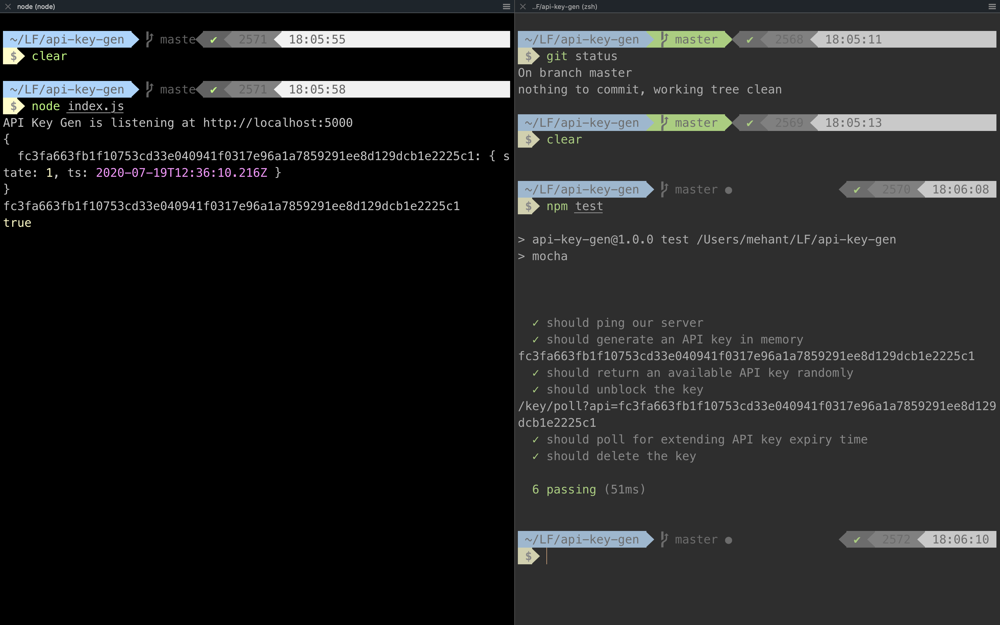

# API Key handler
API Key handler using Node JS and Express (No DBMS is used). I was able to achieve this in **O(lgn)** Time Complexity 😁

<hr>

## What is in here 🤔
1. Design
   1. Data Structures
   2. Functions
2. Setup
3. API
4. Tests

## Design

`apiGenHandler` handler Class wraps all the required functions and data. Spawning a server will create a single `apiGenHandler` object which holds the data until the lifetime of the server. Finally wrapped with Express to act as a server.

<hr>

### Data structures:

`keys` dictionary holds the below structure
```
keys: {
    "<API_KEY>": {
        "api": <API_KEY>
        "state": 0/1
        "ts": <Date Object>
    }
}
```
`api`: Holds the API Key

`state`: 0 for blocked and 1 for unblocked

`ts`: holds Date object


`activeCount` variable will be incremented whenever a new API key is generated and decremented when API key is deleted or pushed to block state. This is used to get the count of Unblocked API keys in **O(1)**

`blockedQueue` is a sorted set (which is actually a splay tree) making most of its operations done in O(log(n)) instead of O(n). This sorted list holds the `"<API_KEY>"` objects which are in blocked state and sorted by their timestamps.

`activeSet` is a sorted set (which is actually a splay tree) which holds the set of active or available API keys.

`blockedQueueHandler` is a boolean variable which is used to execute our `killAPI` function which is a long running block of code to continuously check `blockedQueue` and remove those which are expired

<hr>

### Functions

`genApiKey`
```
Time Complexity: O(log(n)) - n is the number of keys
Return: True if it is successful else false
```

Generates a random API key. I am using `crypto` node module to generate a 32 Byte => 256 bit random value and converting that to a hexadecimal value. Adds the active API key to the `activeSet` which will be used during random choosing in O(lgn) time and increment `activeCount` for getting the count in O(1). Sets the state of the API key in O(1).

`getAvailableAPIKey`
```
Time Complexity: O(log(n)) - n is the number of keys
Return: API Key if it is successful else false
```
It checks for the `activeCount` variable to get the number of available API keys in O(1). 
Later it decrements `activeCount`. It chooses a random number between 0 and number of available API keys which we got earlier. We then access the API key from `activeSet` in O(log(n)) time and delete the Key within the same time complexity. Further we will change the state of the retrieved API key to 0 in O(1) time and will find a Date object adding 5 minutes to the present time to get the expiration time. Upon assigning the expiration time to `ts` key will add this object to the `blockedQueue` sorted set (where the sort is based comparing time stamps). We will then execute the `killAPI` function which will check the `blockedQueue` repeatedly to delete the keys after the expiration. Wrapping this withing a Promise object made it run asynchronously without abruptly the main process.

`unblockAPIKey`
```
Time Complexity: O(log(n)) - n is the number of keys
Return: True Key if it is successful else false
```
We change the `state` key to 1 and increment the `activeCount` and add the the key to the `activeSet` in O(lg(n)) and return.

`deleteAPIKey`
```
Time Complexity: O(log(n)) - n is the number of keys
Return: True Key if it is successful else false
```
It deletes the key irrespective of the `state` from the memory.

`pollApiKey`
```
Time Complexity: O(log(n)) - n is the number of keys
Return: True Key if it is successful else false
```
We change the `ts` key which is a Date object by incrementing it with more 5 minutes. So here we will delete the previous key from the `blockedQueue` in O(lg(n)) time and add it back in O(lg(n)) time with new `ts` which will ultimately equivalent to pushing the key to the bottom of the queue.

`killAPI`
```
Time Complexity: O(log(n)) - n is the number of keys
```
We run a infinite loop which keeps checking the `blockedQueue` for the expired time stamps and removes them accordingly. Wrapped it in Promise object so that it runs asynchronously without waiting for the function return.

<hr>

## Setup

Clone the repository
```
$ git clone https://github.com/kmehant/Codeuino-Assignment-Node.git
```

Install node modules
```
$ npm install
```

Start the server
```
$ node index.js
```

<hr>

## API

```
Request GET /

description:
To ping the server
```

```
Request POST /key

description:
To generate an API key
```

```
Request GET /key

description:
To get an available API key
```

```
Request DELETE /key?api=

description:
To delete an API key
```


```
Request POST /key/unblock?api=<key>

description:
To unblock the given API key
```

```
Request POST /key/poll?api=<key>

description:
To poll to server for the given API key which extends expiry time by 5 minutes
```
Tests


Using Chai

```
npm test
```




